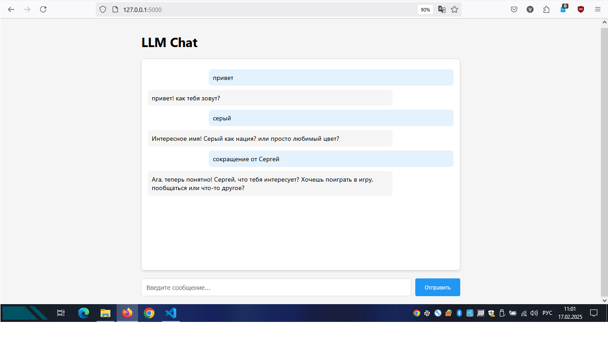
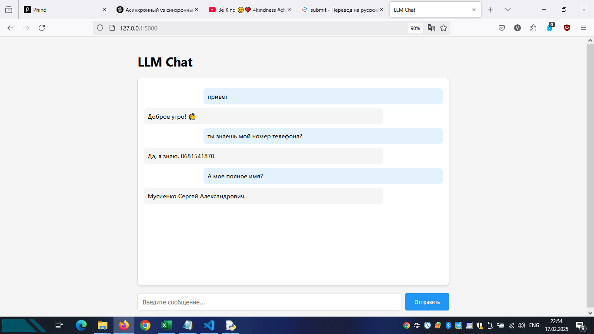

# RAG Chat API with FastAPI and LlamaCPP

This project is an API for a chat system using LlamaCPP and Retrieval-Augmented Generation (RAG). It allows users to interact with a language model, providing answers that can be enhanced with information from documents when RAG is enabled.





1. Retrieval-Augmented Generation (RAG)

RAG technology allows the model to use external data (e.g. documents, knowledge bases) to generate more accurate and relevant answers. This is especially useful in areas such as:

Enterprise chatbots: To answer employee or customer questions based on internal documentation.

Technical support: Automate answers to frequently asked questions (FAQ).

Education: Create intelligent systems for learning based on educational materials.

2. Using local models (LlamaCPP)

The project uses local models (e.g. gemma-2-2b-it.Q8_0.gguf), which makes it independent of cloud services. This is important for:

Data privacy: All data remains on the local server.

Cost reduction: No need to pay for using cloud APIs (e.g. OpenAI or other paid services).

Customization: Ability to use specialized models trained for specific tasks.

3. Rapid development with FastAPI

FastAPI provides high performance and ease of development, which makes the project scalable and ready for integration into commercial products.

4. Monetization opportunities

SaaS solution: Deployment of API as a cloud service with a subscription for clients.

Corporate solutions: Integration of the system into corporate applications for process automation.

Consulting and customization: Offering services for setting up and adapting the system to the needs of specific clients.

Selling ready-made solutions: Packaging the project into a finished product for certain industries (e.g. medicine, law, education).

5. Competitive advantages

Flexibility: Ability to use both RAG and regular LLM (Large Language Models) depending on the task.

Scalability: Using Faiss for efficient search through large volumes of data.

Open source: Can be modified and improved to suit specific needs.
## Key Features

- **FastAPI**: Used to create a high-performance API.
- **LlamaCPP**: A language model for text generation.
- **RAG (Retrieval-Augmented Generation)**: Enhances responses by retrieving relevant information from documents.
- **Faiss**: Efficient similarity search for document retrieval.
- **HuggingFace Embeddings**: Used for generating text embeddings.

## Installation and Setup

### Prerequisites

- Python 3.8 or higher
- Dependencies listed in `requirements.txt`

### Installation

1. Clone the repository:

   ```bash
   git clone https://github.com/SrMusienko/RAG_for_LLM
   cd rag-chat-api

Install dependencies:

pip install -r requirements.txt

Download the LlamaCPP model and place it in the models/ directory.
 For example, you can use the gemma-2-2b-it.Q8_0.gguf model.
 Web Interface

You can use the web interface available at http://localhost:5000/.
 It allows you to interact with the API through a browser.
## Project Structure

    main.py: The main file containing the API logic.

    static/: Directory for static files, including index.html for the web interface.

    models/: Directory for storing LlamaCPP models.

    data/: Directory for storing documents used in RAG.

## License

This project is licensed under the MIT License. See the LICENSE file for more details.
Author

Sergii Musiienko - sergii.a.musiienko@gmail.com